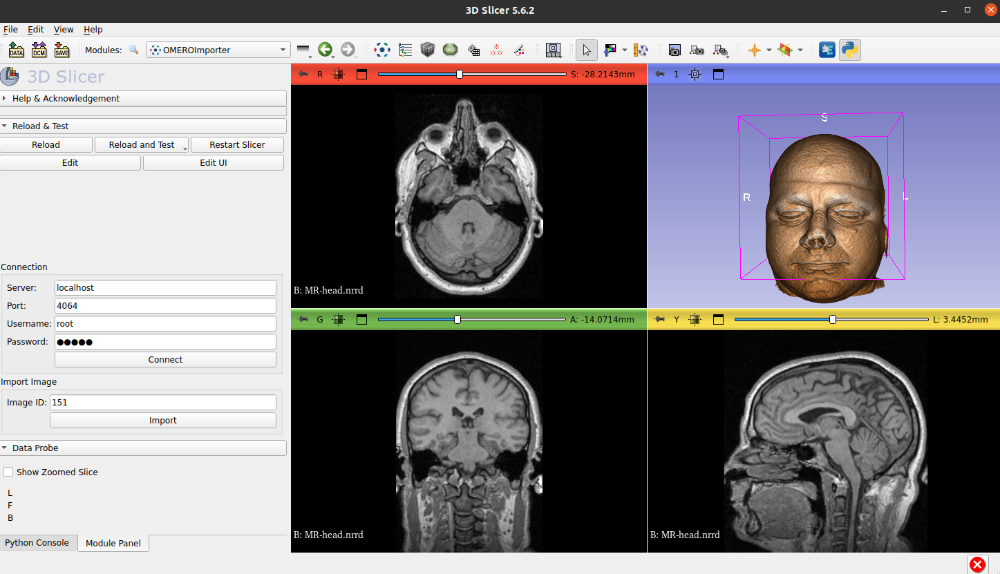

## OMEROSlicer : Connect to OMERO and visualize in 3D slicer.

NOTE : This is a prototype. The work is in progress.

 

### MODULE : OMEROImporter

#### User Interface (UI)

 

 

### How to install ?

1. Click on Code and Download zip.
2. Unzip the folder in your computer.
3. Open 3D slicer and go to the modules drop down.
4. Select the category Developer tools and select Extension wizard.
5. Click on Select Extension and find the unziped extension folder.
6. Go in the folder and click on select folder.
7. You can find the module in modules drown down.

Reference : [Example Installation Instructions](https://www.youtube.com/watch?v=QsxzjQb05D4&t=106s)

 

### How it Works ?

OMEROImporter uses python api to read the pixel data from OMERO with the help of UI form submitted by user.

1. Select the dropdown and find OMERO in the list.
2. Click on the OMEROImporter.
3. Fill in the UI form to connect to OMERO and press Connect.
4. Fill in the image id from OMERO and press import.
5. Your 3D image appears in the right panel.
